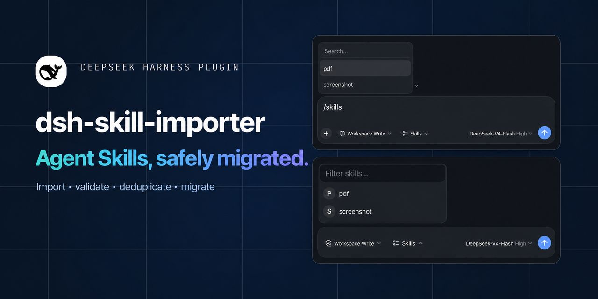
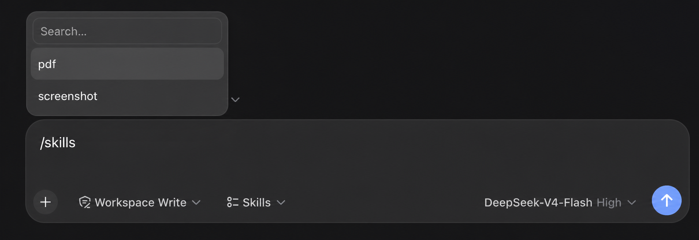
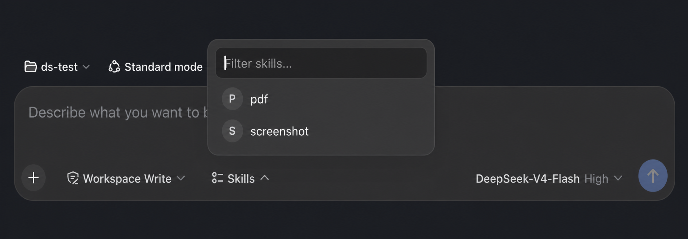

<div align="center">
  

  <br />

  <strong>Bring skill management into the DeepSeek Harness Web UI.</strong><br />
  Import, validate, deduplicate, and migrate Agent Skills across DeepSeek Harness, Claude Code, Codex, and other AI coding agents.<br />
  Discover and invoke them without a session, model tokens, or approval round-trips.

  <br /><br />

  [](https://www.npmjs.com/package/dsh-skill-importer)
  [](https://www.npmjs.com/package/dsh-skill-importer)
  [](https://github.com/deepseek-ai/deepseek-harness)
  [](LICENSE)

  <br />

  **English** · [简体中文](README.zh.md) · [Install](#installation) · [How it works](#how-it-works) · [Development](#development)
</div>

---

## Your skill library, one click away

`dsh-skill-importer` is a lightweight plugin for [DeepSeek Harness](https://github.com/deepseek-ai/deepseek-harness) (`dsh`). It turns skills into a first-class part of the Web UI: bring in Markdown from disk or a URL, see every installed copy, and insert a skill into the composer without breaking your flow.

| Import | Organize | Invoke |
| :--- | :--- | :--- |
| Upload `SKILL.md`, paste a URL, or migrate a complete skills directory from Claude Code, Codex, and similar agents. | Browse skills grouped across project and global roots. Remove any copy individually. | Use the composer picker, run `/skills`, or type `/skill-name` directly. |

### See it in action

| `/skills` command | Composer picker |
| :---: | :---: |
|  |  |
| Choose a skill from the command palette without leaving the composer. | Open the skill library from the composer footer and insert it in one click. |

### Built for a fast loop

- **No agent or session** — the host writes skill files directly.
- **Zero model tokens** — imports never enter a model context.
- **Instant discovery** — the harness watcher hot-refreshes skills after they land.
- **Workspace-aware** — project skills always target the active registered workspace.
- **Bilingual UI** — English and Chinese copy follows the harness locale.
- **Safe by design** — fixed skill roots, 256 KB limit, and same-origin POST checks.

### Batch migration with a real preflight

The third import entry accepts a local skills root such as `~/.claude/skills`, `~/.codex/skills`, or another `.agents/skills` directory. It scans before it writes, validates every `SKILL.md`, preserves each skill's `scripts`, `references`, `assets`, and other resources, and reports invalid entries without touching the destination.

Destination name conflicts are skipped by default. Choose **Replace** per skill, review the add/replace/skip summary, then confirm. Each accepted skill is copied through a same-root staging directory; replacements keep a temporary backup and roll back if the swap fails. A preflight is single-use, expires after ten minutes, and verifies source-content fingerprints again at commit time.

## Three natural ways to use a skill

1. **Composer picker** — open the pill beside the access-mode selector, search by name, and choose.
2. **`/skills` command** — use a familiar command palette, modeled after `/model`.
3. **Direct invocation** — type `/skill-name` and keep moving.

All three fill the composer with the same highlighted `/name ` gesture; sending injects the skill instructions through dsh's native flow.

## Installation

### First install

```sh
npx @deepseek-ai/dsh plugin --profile web add dsh-skill-importer@latest
```

The plugin registers itself with the Web profile through `dsh.bundle`; do not edit `cordis.patch.yml` manually.

Restart dsh Web after installation:

```sh
npx @deepseek-ai/dsh web
```

### Update to the latest version

Existing users can run the same command to update:

```sh
npx @deepseek-ai/dsh plugin --profile web add dsh-skill-importer@latest
```

Updating replaces only the plugin package. It does not remove skills from `.dsh/skills`, `.agents/skills`, `~/.dsh/skills`, or `~/.agents/skills`. Restart dsh Web after updating.

Check the latest published version:

```sh
npm view dsh-skill-importer version
```

List the plugins installed in the Web profile:

```sh
npx @deepseek-ai/dsh plugin --profile web list
```

#### Supply-chain waiting period for new releases

DSH profiles use pnpm to manage plugins. pnpm's `minimumReleaseAge` policy delays newly published versions; during that window, `@latest` may still resolve to the previous mature release. This is an intentional supply-chain safeguard, not a download failure. The recommended path is to wait for the profile's configured window, then rerun the `@latest` command above.

Pre-1.0 semver ranges also stop at the next minor: for example, `^0.1.2` does not include `0.2.0`. After the waiting period, specify the target version when crossing a minor:

```sh
npx @deepseek-ai/dsh plugin --profile web add dsh-skill-importer@X.Y.Z
```

If you have verified the release and must install it immediately, add a temporary exception for that **exact version** to `$DSH_HOME/profiles/web/pnpm-workspace.yaml`, then run the exact-version command:

```yaml
minimumReleaseAgeExclude:
  - dsh-skill-importer@X.Y.Z
```

Replace both `X.Y.Z` placeholders with the same target version. This opts that version out of the supply-chain waiting period. Do not permanently exempt the package name; remove the exact-version exception after the release matures.

Open **Settings → Skills**. Import a Markdown file or URL, or choose **Batch import** to migrate another agent's complete skills directory. Choose a target and the imported skills will appear as soon as the filesystem watcher discovers them.

> Requires DeepSeek Harness `>= 0.1.0-rc.6`.

### Duplicate plugin after upgrading

If startup fails with `duplicate loader entry id: skill-importer`, the profile still contains the old manual configuration. Remove the manually added `skill-importer` entry from `$DSH_HOME/profiles/web/cordis.patch.yml`, then restart dsh Web. Current releases register automatically and do not need that entry.

## How it works

The dsh client-to-host RPC is a fixed allowlist with no file-write channel. This plugin uses the official `ctx.webServer.register` extension point exposed by [`dsh-host-webserver`](https://github.com/deepseek-ai/deepseek-harness/tree/master/packages/host/webserver) and registers same-origin `/skill-importer/*` routes on the harness server.

```text
Markdown file or URL
        │  same-origin fetch
        ▼
/skill-importer/import
        │  host filesystem write
        ▼
<skill-root>/<name>/SKILL.md
        │  watcher event
        ▼
skills/change → hot refresh
```

POST routes verify the `Origin` header and only accept loopback sources (`127.0.0.1` or `localhost`). Writes are restricted to four default writable DSH roots:

| Writable target order | Scope | Directory |
| :---: | :--- | :--- |
| 1/4 | DSH project | `.dsh/skills` |
| 2/4 | Shared project | `.agents/skills` |
| 3/4 | DSH global | `~/.dsh/skills` |
| 4/4 | Shared global | `~/.agents/skills` |

Lower numbers win among these four writable import targets. DSH-configured `customSkillDirs` sit between project and global roots in the full discovery order, but have no single stable write destination and therefore are not import targets. Bundled skills ship with DSH and cannot be overwritten by the plugin.

## Development

```sh
npm install
npm run build
```

| Area | Source |
| :--- | :--- |
| Host plugin and route registration | `src/index.ts` |
| Filesystem, URL import, and HTTP logic | `src/server.ts` |
| Shared wire types | `src/types.ts` |
| Browser plugin and `/skills` command | `src/client/index.ts` |
| Composer picker | `src/client/SkillsPicker.tsx` |
| Settings experience | `src/client/SkillImporterSection.tsx` |

Available routes: `GET /skill-importer/health` · `GET /skill-importer/list` · `POST /skill-importer/import` · `POST /skill-importer/import-url` · `POST /skill-importer/delete` · `POST /skill-importer/batch/scan` · `POST /skill-importer/batch/commit`

### Local checkout

```sh
npm install
npm run build
dsh plugin --profile web add /path/to/dsh-skill-importer
```

If `dsh` is not installed globally, replace the last line with `npx @deepseek-ai/dsh plugin --profile web add /path/to/dsh-skill-importer`. The plugin registers automatically; restart dsh Web afterward.

## Notes

- A single imported file may be up to 256 KB.
- Batch import accepts any agent directory named `skills` (for example `.claude/skills`, `.codex/skills`, or a custom `agent/skills`) or one skill directory directly below it. A scan accepts up to 200 skills; each skill may contain up to 2,000 files and 10 MB of resources. Symbolic links are refused.
- URL import is HTTPS-only and refuses loopback, private, link-local, and reserved addresses; every redirect is validated again. `.md` sources are preserved, while HTML pages use lightweight text extraction, so direct Markdown URLs work best.
- The installed list polls briefly after import (every 2 seconds for up to 20 seconds). **Refresh** syncs external changes immediately.

## License

Released under the [MIT License](LICENSE).
