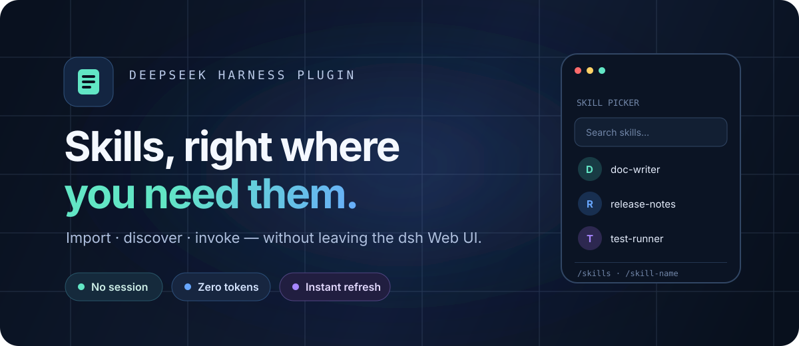

<div align="center">
  

  <br />

  <strong>把技能管理带进 DeepSeek Harness Web UI。</strong><br />
  无需会话、不耗模型 Token、没有审批往返，导入后立即可用。

  <br /><br />

  [](https://www.npmjs.com/package/dsh-skill-importer)
  [](https://www.npmjs.com/package/dsh-skill-importer)
  [](https://github.com/deepseek-ai/deepseek-harness)
  [](LICENSE)

  <br />

  [English](README.md) · **简体中文** · [安装](#安装) · [工作原理](#工作原理) · [开发](#开发)
</div>

---

## 你的技能库，一键即达

`dsh-skill-importer` 是 [DeepSeek Harness](https://github.com/deepseek-ai/deepseek-harness)（`dsh`）的轻量技能管理插件。它把技能变成 Web UI 的一等公民：从本地或 URL 导入 Markdown、查看每一份已安装副本，并在输入框中自然调用，全程不打断工作流。

| 导入 | 管理 | 调用 |
| :--- | :--- | :--- |
| 上传 `SKILL.md` 或粘贴 URL，写入前自动校验并规范化 frontmatter。 | 按项目和全局目录分组查看，每个副本都能独立删除。 | 使用输入框选择器、运行 `/skills`，或直接输入 `/skill-name`。 |

### 为高速工作流而生

- **无需 Agent 或会话** — host 进程直接写入技能文件。
- **零模型 Token** — 导入过程不会进入模型上下文。
- **即时发现** — 文件落盘后由 harness watcher 热刷新。
- **工作区感知** — 项目技能始终写入当前注册工作区。
- **中英双语** — UI 文案自动跟随 harness 语言。
- **安全边界清晰** — 固定技能目录、256 KB 限制、同源 POST 校验。

## 三种自然的技能入口

1. **输入框选择器** — 点击权限模式旁边的 pill，按名称搜索并选中。
2. **`/skills` 命令** — 像使用 `/model` 一样打开技能命令面板。
3. **直接调用** — 输入 `/skill-name`，继续你的工作。

三种入口最终都会在输入框填入同一个高亮的 `/name ` 手势；发送后由 dsh 原生流程注入技能指令。

## 安装

### 1. 安装到 Web profile

```sh
dsh plugin --profile web add dsh-skill-importer
```

### 2. 在 profile 中启用

向 `$DSH_HOME/profiles/web/cordis.patch.yml` 添加：

```yaml
- id: skill-importer
  name: dsh-skill-importer
```

### 3. 重启 dsh Web

打开 **设置 → 技能**，选择 Markdown 文件或粘贴 URL，再选择目标目录。文件系统 watcher 发现后，技能会立即出现。

> 需要 DeepSeek Harness `>= 0.1.0-rc.6`，使用 `npx @deepseek-ai/dsh web` 运行。

## 工作原理

dsh 的 client→host RPC 是固定白名单，没有文件写入通道。本插件使用 [`dsh-host-webserver`](https://github.com/deepseek-ai/deepseek-harness/tree/master/packages/host/webserver) 提供的官方 `ctx.webServer.register` 扩展点，在 harness 自身服务器上注册同源 `/skill-importer/*` 路由。

```text
Markdown 文件或 URL
        │  同源 fetch
        ▼
/skill-importer/import
        │  host 文件系统写入
        ▼
<skill-root>/<name>/SKILL.md
        │  watcher 事件
        ▼
skills/change → 热刷新
```

所有 POST 路由都会校验 `Origin`，仅接受 loopback 来源（`127.0.0.1` 或 `localhost`）。写入范围固定为两个标准目录：

| 范围 | 目录 |
| :--- | :--- |
| 项目 | `.agents/skills` |
| 全局 | `~/.dsh/skills` |

## 开发

```sh
npm install
npm run build
```

| 模块 | 源码 |
| :--- | :--- |
| Host 插件与路由注册 | `src/index.ts` |
| 文件系统、URL 导入与 HTTP 逻辑 | `src/server.ts` |
| Host/client 共享类型 | `src/types.ts` |
| 浏览器插件与 `/skills` 命令 | `src/client/index.ts` |
| 输入框技能选择器 | `src/client/SkillsPicker.tsx` |
| 设置页 | `src/client/SkillImporterSection.tsx` |

路由一览：`GET /skill-importer/health` · `GET /skill-importer/list` · `POST /skill-importer/import` · `POST /skill-importer/import-url` · `POST /skill-importer/delete`

### 本地源码安装

```sh
npm install
npm run build
dsh plugin --profile web add /path/to/dsh-skill-importer
```

随后添加上文的 profile 配置并重启 dsh Web。

## 注意事项

- 单个导入文件最大 256 KB。
- URL 导入会原样保留 `.md`；HTML 页面仅做轻量正文提取，因此推荐使用 Markdown 直链。
- 导入后列表会短暂轮询（每 2 秒一次，最多 20 秒）；外部改动可点击 **刷新** 立即同步。

## License

基于 [MIT License](LICENSE) 开源。
